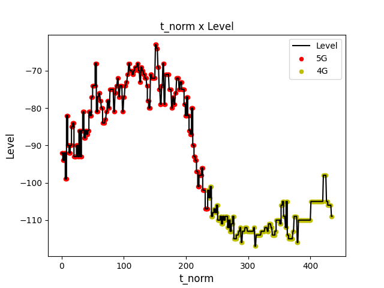
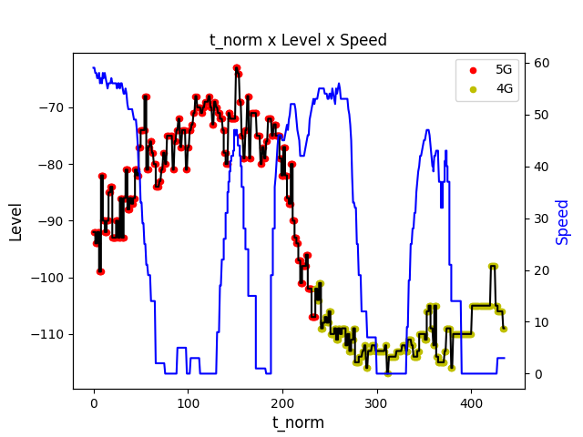

# Análise de métricas em redes móveis

## Descrição do Projeto

Com o aplicativio G-NetTrack Lite podemos obter algumas informações referente a conexão de dados móveis e wi-fi. Ele gera um log em .txt com todos esses dados, o código presente aqui visa tratar essas informações, salvando as em um .json, além disso, é possível gerar alguns gráficos para interpetrar os resultados coletados

Tabela de conteúdos
=================
<!--ts-->
   * [Requirements](#requirements)
   * [Como usar](#como-usar)
   * [Exemplo](#exemplo)
<!--te-->

# Requirements
> - Python > 3
> - Json - pip install jsonlib
> - Env - pip install virtualenv
> - Numpy - https://numpy.org/install/
> - Matplotlib - https://matplotlib.org

# Como usar

O código pode ser rodado em main.py. A primeira função que precisa ser chamada é a dict_data_bus, ela é responsável por ler e tratar os logs gerados pelo app.

* raw: Nome do arquivo de log
* name_json: Nome do arquivo de saída .json

```
dict_data = dict_data_bus(name_json=, raw=)
```

Com os dados lidos e armazenados na variável dict_data e no .json, pode se chamar a função que gera os gráficos. É possível gerar gráficos de pontos, linha com pontos, duas linhas e duas linhas com pontos.

Uma observação imporante, é que somente data abaixo não é uma string, todos os outros argumentos representam o nome da variável que se deseja plotar.

* data: Dicionário com os dados tratados
* x: Dado a ser plotado no eixo x, geralmente o timestamp
* y1: Dado que será plotado no eixo y a esquerda
* points: Se deseja plotar alguns pontos no gráfico
* y2: Dado que será plotado no eixo y a direita
* title_text: Titulo do gráfico
* name_save: Onde será salvo

```
plot_data(data, x, y1, points=False, y2=False, title_text="", name_save=False):
```

# Exemplo

OBS: t_norm: é o timestamp normalizado, considerando a primeiro como zero e os próximos como a diferença em relação a ele, em segundos.

No primeiro exemplo, temos a intensidade do sinal em relação ao tipo de rede 4G ou 5G.

```
if __name__ == "__main__":
    dict_data = dict_data_bus()

    plot_data(dict_data, "t_norm", "Level", points="NetworkTech")
```

<figure>
    
</figure>

Adicionando mais um dado ao eixo y

```
if __name__ == "__main__":
    dict_data = dict_data_bus()

    plot_data(dict_data, "t_norm", "Level", y2="Speed", points="NetworkTech")
```

<figure>
    
</figure>
